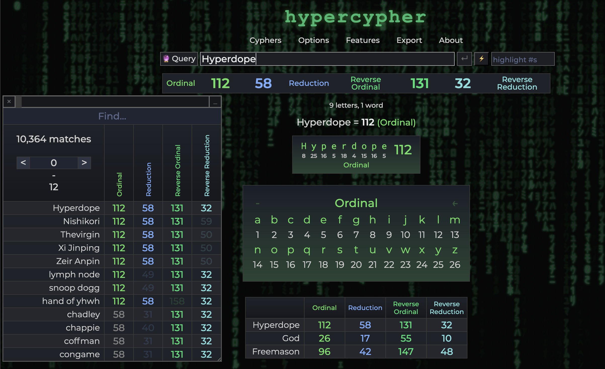

## Hyperdope Gematria

---
> NOTE: Use a desktop Chromium based browser for best experience

## About The Project

Decode your reality.  Discover hidden synchronicities.  Gematria is everywhere!

Try it live at http://www.hyperdope.com/gematria

The Hyperdope Gematria project values these principles:

<ul>
<li>Accessible and relevant word and phrase matching</li>
<li>Favor inclusion of well-defined cyphers useful to the community</li>
<li>Free and open source</li>
</ul>

### Features:
<ul>
<li>AUTOLOADING gematria word database for instant phrase matching</li>
<li>History table editing</li>
<li>Dynamic highlighter with filtering</li>
<li>Support for characters with diacritical marks</li>
<li>History export/import (CSV format)</li>
<li>Fully customizable cyphers (Unicode)</li>
<li>Color controls</li>
<li>Screenshot tools</li>
<li>Quickstart guide</li>
</ul>

## Getting Started

To learn more about how to use Hyperdope Gematria, see the Quickstart Guide in the app under the About menu.

This repo can be cloned as-is to your **web server** for self-hosting your own fully-featured gematira calulator.

To add more words or phrases to the matching database append them as new lines to the db.txt file.

> NOTE: You must run this app from a web server for the word matching database to autoload due to the way browsers handle local file security.  Please see [this CORS error article](https://stackoverflow.com/questions/58879729/access-to-xmlhttprequest-at-file-sample-txt-from-origin-null-blocked-by-c) for more information.  A quick way to run db matching offline locally is to open the project folder in VS Code and launch it with the Live Server extension.  

If you do not need the auto loading db feature, simply download the repo and open index.html.  

## Contributing

Any contributions you make are **greatly appreciated**.  Please report any issues or bugs.  Errors in the cyphers will be fixed with highest priority.

If you have a suggestion that would improve the tool, please fork the repo and create a pull request. You can also simply open an issue with the tag "enhancement".

1. Fork the Project
2. Create your Feature Branch (`git checkout -b feature/AmazingFeature`)
3. Commit your Changes (`git commit -m 'Add some AmazingFeature'`)
4. Push to the Branch (`git push origin feature/AmazingFeature`)
5. Open a Pull Request

 
<!-- LICENSE -->
## License

Distributed under the GNU General Public License v2.0. See `LICENSE` for more information.

<!-- CONTACT -->
## Contact

Hyperdope Official - [@LNHyper on Twitter/X](https://twitter.com/lnhyper) - hyperdopeofficial@protonmail.com

Project Link: [Hyperdope Gematria](https://github.com/malonehunter/hyperdope-gematria)

<!-- ACKNOWLEDGMENTS -->
## Acknowledgments

* Special thanks to Saun-Virroco, the creator of Gematro, on which this calculator is almost entirely based.  
* [NetVoid, who preserved the Gematro repo and secured the database](https://github.com/CyphersNews/cyphersnews.github.io)
* [Alektryon, who contributed key cyphers and configurations](https://github.com/Alektryon)