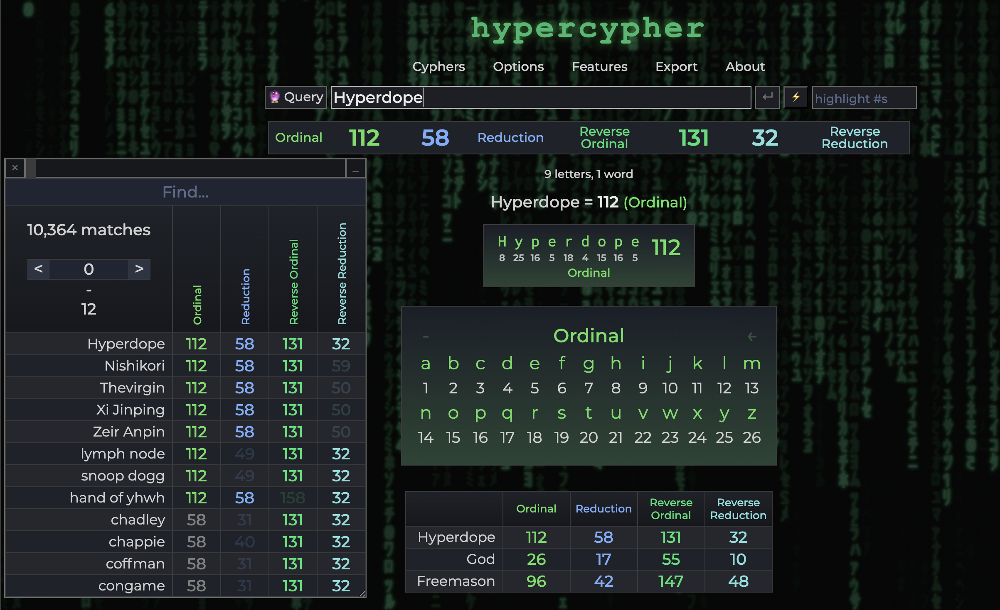

# Cypher Calculator

A gematria cypher calculator with pre-computed instant matching, 145k+ curated word database, and full whitelabel support via `config.js`.

**[Try it live →](https://cypher.hyperdope.com)**



## Quick Start

```bash
git clone https://github.com/malonehunter/hyperdope-gematria.git
cd hyperdope-gematria

# Create your config (gitignored — won't be overwritten by updates)
cp config.default.js config.js
# Edit config.js — change siteName, colors, links, credits, etc.

# Serve locally (web server required for database loading)
python3 -m http.server 8000
# Open http://localhost:8000
```

> **Note:** Must run from a web server (not `file://`) due to browser CORS restrictions. VS Code Live Server extension also works.

## Customization

All branding lives in `config.js`. Copy `config.default.js` to `config.js` and edit:

```javascript
var CALC_CONFIG = {
  siteName: "My Calculator",               // logo text
  siteTitle: "My Calculator — Gematria",   // browser tab title
  logoColor: "hsl(148, 60%, 45%)",         // green like the code rain
  logoHoverMatrix: true,                   // matrix font hover on logo letters
  aboutLinks: [
    { text: "My Site", url: "https://example.com" },
  ],
  credits: [
    { name: "Your Name", role: "Fork maintainer" },
  ],
  // Custom cipher category groupings
  customCategories: [
    { name: "CCRU", ciphers: ["Alphanumeric Qabbala", "Synx", "Keypad"] },
  ],
  // See config.default.js for all options
};
```

`config.js` is in `.gitignore` — your customizations survive `git pull`.

## Updating

```bash
git pull origin master
# Your config.js is safe (gitignored)
# db.txt updates improve matches automatically
```

## Database

**145,821 curated entries** — cleaned and enriched from the original 153k user-search database.

- **Removed:** 13,317 junk entries (spam, gibberish, personal rants, serial spammers)
- **Added:** 8,536 terms across 17 research categories (occult, theology, 9/11, gematria, psyop, cosmology, bitcoin, AI, coronavirus, world affairs, economics, health, intelligence, history, politics, civil liberties, free speech)

### Pre-computed Mode

For instant matching (~100ms vs 2-5s), generate `db.json` with all 69 cipher values pre-calculated per entry. The calculator tries `db.json` first, falls back to `db.txt`. Set `databaseMode` in config.js.

### Adding Entries

Append phrases as new lines to `db.txt`. File must start with `CREATE_GEMATRO_DB`.

## Features

- 85 ciphers (69 English + Hebrew, Greek, Arabic, Russian)
- Pre-computed instant matching via db.json
- Auto-match on Enter (configurable toggle)
- Escape closes modal / clears filter
- Mobile optimized (keyboard dismisses, touch minimize)
- 10 calculator themes
- Custom cipher categories via config
- Matrix font hover effect
- History table with highlighting and export
- Date calculator, word breakdown, screenshots
- Drag & drop file import

## File Structure

```
├── index.html          # Main page
├── config.js           # Your config (gitignored)
├── config.default.js   # Template — copy to config.js
├── db.txt              # 145k word matching database
├── calc/               # Calculator JS + CSS
├── theme/              # 10 color themes
├── font/               # Matrix, Montserrat, Roboto Mono
└── res/                # Favicon, logos, assets
```

## Acknowledgments

- **Saun-Virroco** — Original Gematro creator
- **[NetVoid](https://cyphers.news/)** — Preserved codebase & database, v2 cleanup help
- **[Alektryon](https://github.com/Alektryon)** — Cipher contributions & reviews
- **[Hyperdope](https://hyperdope.com)** — Database overhaul, v2 architecture

## Contact

[@LNHyper on X](https://twitter.com/lnhyper) · hyperdopeofficial@protonmail.com

## License

MIT
